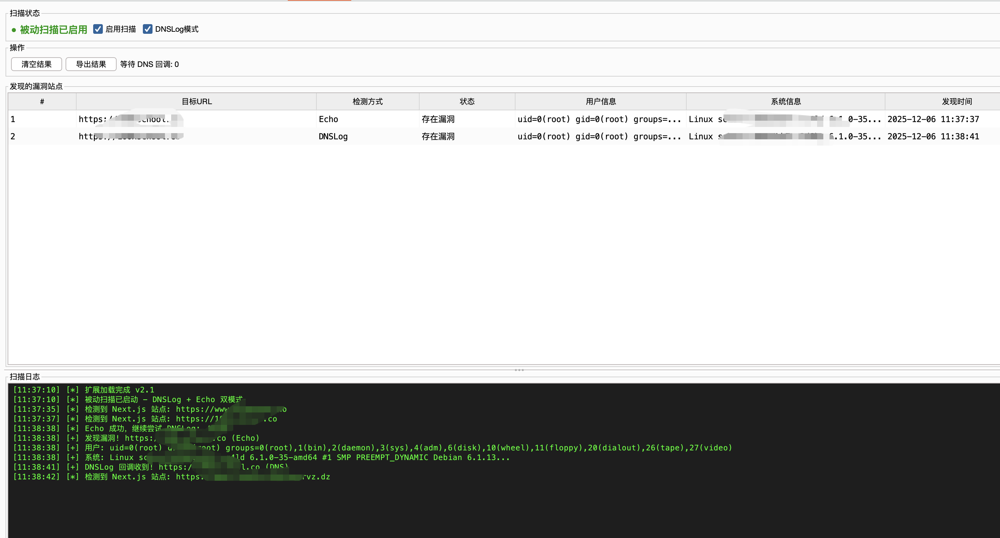

## CVE-2025-55182 Next.js RCE Burp 扩展

## 🔥 Features

### 功能

- **被动扫描**: 自动检测所有经过 Burp 的 Next.js 站点
- **双重检测**: [新增] 同时执行 **Echo** 和 **DNSLog** (Burp Collaborator) 检测，确保不漏报
- **UI 改进**: 日志区域可调整大小
- **自动利用**: 发现漏洞后自动执行 `id` 和 `uname -a` 获取系统信息
- **结果列表**: 表格形式展示所有漏洞站点

- **命令执行**: 右键表格可对目标执行自定义命令
- **Scanner 集成**: Findings are also reported to Burp Scanner as High severity issues
- **右键菜单 (Context Menu)**: Right-click any request to manually test for the vulnerability

### 安装

1. 下载 `nextjs-rce-scanner-1.0.0.jar`
2. Burp Suite → **Extender** → **Extensions** → **Add**
3. Extension type: **Java**
4. 选择 JAR 文件

### 使用

1. 加载扩展后，会出现 **"Next.js RCE"** 标签页
2. 正常浏览网站即可
3. 扩展自动检测 Next.js 站点并测试漏洞
4. 发现漏洞的站点会显示在表格中

### 手动测试

在 Burp 中右键任意请求 → **"测试 Next.js RCE 漏洞"**

### 执行命令

1. 右键表格中的漏洞站点
2. 选择 **"执行命令..."**
3. 输入命令

### 编译

```bash
cd CVE-2025-55182-BurpExtension
mvn clean package -DskipTests
```

JAR 生成在 `target/nextjs-rce-scanner-1.0.0.jar`

---
